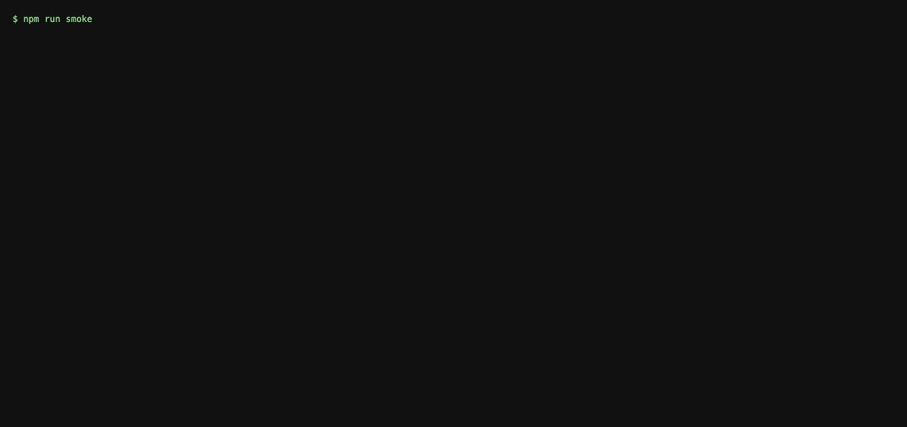

# retell-llm-bench

An offline test bench for [Retell](https://www.retellai.com) custom-LLM servers. It plays the Retell side of the custom-LLM WebSocket protocol against any local server, runs a YAML scenario suite, and prints a results table: time to first sentence, `content_complete` discipline, tool calls missing / unnecessary / duplicate, and protocol violations.

**Why it exists.** Retell's docs say a custom-LLM agent cannot use the playground, simulation testing, or batch testing, so "Web and phone calls are the only way to test" (https://docs.retellai.com/integrate-llm/overview). This bench is the missing offline harness. I built it as a skills demonstration for the Forward Deployed Engineer, New Grad role (https://www.workatastartup.com/jobs/109576).



## Run it in three commands

```bash
npm install
npm run smoke      # no key: runs the suite against a scripted fake server (started in-process) and writes docs/smoke.txt
npm run results    # with ANTHROPIC_API_KEY in .env.local (see .env.example): starts the Claude reference server in-process, 3 runs per scenario, writes docs/results.md
```

All three run in one terminal. To point the bench at your own server: start it (or `npm run server` for the bundled Claude one on `ws://127.0.0.1:3217/llm-websocket`, or `npm run fake` for the scripted one on port 3218) and in a second terminal run `npm run bench -- --url ws://127.0.0.1:8080/llm-websocket --runs 3 --json out.json`. Both bundled servers listen on 127.0.0.1 only.

## What the bench does

For each scenario it opens `ws://<host>/llm-websocket/<call_id>`, waits for the server's `config` and the begin message (`response_id: 0`), then plays the caller's turns: `update_only` with the transcript and `turntaking: "user_turn"`, then `response_required` with the next `response_id`. A turn can carry an **interruption** (more caller speech after N ms and a new `response_required` with a higher `response_id`, so the earlier one is superseded, exactly as Retell does when the caller keeps talking) or be a **reminder** (`reminder_required`). An interruption's `after_ms` counts from the `response_required` send; `after_first_chunk_ms` counts from the agent's first spoken chunk instead, so "interrupt mid-sentence" lands after the agent has actually started talking. When the server's config asks for `auto_reconnect`, the bench sends `ping_pong` every 2 s and expects the echo within 5 s. Every server frame is validated with zod schemas built from the protocol reference; frames Retell would drop or misread become findings instead of silent failures. Below the table, `docs/results.md` prints one **transcript diff** per run: the scenario's `expect.agent_transcript` (the author's reference wording) against what the server actually said, as a unified-style diff, so wording drift is visible without being scored (in interrupt scenarios the text spoken before the interruption shows as one extra `+` line).

Per scenario it reports:

| column | meaning |
|---|---|
| ttfs p50 / p90 | time from `response_required` to the first chunk that completes a sentence, pooled across runs |
| complete | live `response_id`s that received `content_complete: true` / requested |
| missing | expected tool calls (name + argument subset) never invoked |
| unnecessary | tool calls that were forbidden by the scenario or not expected at all |
| duplicate | same tool + same arguments (`message` excluded) more than once for one caller request across a supersede |
| violations | protocol violations: wrong types, missing `response_type`, wrong `response_id`, mutually exclusive actions, config not first (a missed keepalive echo is a separate finding) |
| text miss | expected phrases the agent never said (optional per scenario) |
| must complete | begin message received and every live turn completed |

Findings that are listed under the table rather than counted in a column: `silent_tool_turn` (a turn ran a tool but sent no spoken text before `content_complete`, the trap Retell's guide describes for tools without a `message` parameter), `tool_args_mismatch` (the expected tool was called with arguments that match no expected entry, for example the pre-interrupt slot was booked before the caller changed it; informational, it does not fail the scenario), `stale_chunks` (content for a superseded `response_id` after the newer request), `keepalive_missed`, `voice_markdown`, `agent_text_missing`.

## Results (Claude reference server, 3 runs per scenario)

Generated by `npm run results`, which starts the reference server in-process and writes `docs/results.md` from the bench's JSON output; the full file with every finding and transcript diff is `docs/results.md`.

| scenario | runs | ttfs p50 | ttfs p90 | complete | missing | unnecessary | duplicate | violations | text miss | must complete |
| --- | --- | --- | --- | --- | --- | --- | --- | --- | --- | --- |
| book-appointment | 3 | 1559 ms | 2333 ms | 3/3 | 0 | 0 | 0 | 0 | 0 | ok |
| caller-goes-quiet | 3 | 1376 ms | 1394 ms | 6/6 | 0 | 0 | 0 | 0 | 0 | ok |
| caller-says-goodbye | 3 | 1331 ms | 1566 ms | 3/3 | 0 | 0 | 0 | 0 | 0 | ok |
| change-mind-before-booking | 3 | 1228 ms | 1319 ms | 3/3 | 0 | 0 | 0 | 0 | 0 | ok |
| clinical-question | 3 | 1375 ms | 1651 ms | 3/3 | 0 | 0 | 0 | 0 | 0 | ok |
| fee-not-in-kb | 3 | 1455 ms | 1675 ms | 3/3 | 0 | 0 | 0 | 0 | 0 | ok |
| interrupt-mid-sentence | 3 | 1654 ms | 1939 ms | 3/3 | 0 | 0 | 0 | 0 | 0 | ok |
| reschedule-appointment | 3 | 968 ms | 1721 ms | 6/6 | 2 | 0 | 0 | 0 | 0 | ok |
| unintelligible-audio | 3 | 1438 ms | 1445 ms | 3/3 | 0 | 0 | 0 | 0 | 0 | ok |

Findings that are expected: `change-mind-before-booking` is the trap Retell's best-practice page describes (a fast tool commits before the supersede arrives). In this run the 200 ms interrupt arrived before the model reached the tool, so nothing was booked; a faster tool or a slower interrupt would show the trap. Numbers vary between runs; they are reported, not asserted. In this run `reschedule-appointment` missed its booking in two of three runs: the model asked the caller to confirm the new slot instead of calling `book_appointment`, which the bench reports as `tool_missing` and the transcript diff shows word for word.

## The reference server

`npm run server` starts a small custom-LLM server that follows Retell's best-practice page: it streams Claude's text straight into `response` chunks, sends `content_complete: true` in a `finally` block, aborts generation once a newer `response_id` arrives, emits `tool_call_invocation` / `tool_call_result`, echoes `ping_pong`, and exposes two tools that each carry a `message` parameter (`book_appointment`, `end_call`). Bookings are idempotent, keyed on call id + arguments. The protocol logic lives in `src/server/session.ts` behind an `LlmClient` interface, so it is fully tested with a fake LLM and no key. It sends no sampling parameters: Retell's guide recommends temperature 0 with tools for OpenAI models, but Claude Sonnet 5 rejects non-default sampling parameters, so the request carries only `max_tokens: 300` and `thinking: { type: 'disabled' }` (thinking off so time to first sentence measures the server, not hidden reasoning).

## Scenarios

Nine YAML files in `scenarios/`: book, reschedule, interrupt mid-sentence, caller goes quiet (reminder), fee not in the knowledge base, clinical question, goodbye (`end_call`), unintelligible audio, and change of mind before booking. A scenario is a list of turns plus expectations (`tool_calls`, `forbidden_tools`, `must_complete`, `agent_text_contains`) and an `agent_transcript` of reference wording that the report diffs against the actual transcript; add your own by dropping a file in the folder.

## Tests

`npm test` runs the vitest suite: protocol schemas, the fake server, the bench client, scenarios, metrics, scoring, the transcript diff, the runner, the CLI, the booking store, and the reference session (with a fake LLM). Nothing in the tests needs a key or a network.

## What was left out, and why

- **No Retell account, no hosted API, no real call.** The bench talks only to local WebSocket servers; the protocol comes from Retell's public reference (`docs/api-notes.md` records every field and its source).
- **No LLM-judge grading.** Findings are deterministic (expected tool set, completion, protocol rules) so there is no judge bias; grading tone or grounding would need a judge and is listed below.
- **`agent_interrupt`, `update_agent`, `metadata`** are accepted by `response_type` only (their fields are not validated) because the bench never asks for them and never scores them.
- **No reconnect simulation** (Retell's 3-attempt connect and mid-call reconnects) and no `transcript_with_tool_calls` playback.
- **Transcript diffs are informational.** Model wording varies between runs, so the diff against `agent_transcript` is printed, not scored; the scored text check is the `agent_text_contains` substring list.
- **One tool call per turn in the reference server, then at most one follow-up generation.** If the model returns two tool uses in one turn, the server runs the first, logs the rest, and finishes the turn; the bench would show the dropped call as `tool_missing`.
- **TTFS counts only `response_required` turns.** A `reminder_required` nudge is timed by the same clock but kept out of the p50/p90 pool, so the column means what its name says.

## What I'd add next

- A latency budget per turn (Retell reports `llm` and `llm_websocket_network_rtt`; the bench could flag turns over a threshold).
- LLM-judge grading for grounding and tone, kept separate from the deterministic columns.
- Recorded real-call transcripts as scenarios, once a Retell account is in the picture.
- A `retell-llm-protocol` package extracted from `src/protocol/schemas.ts`.

## Layout

```
src/protocol/   zod schemas + validateServerFrame
src/bench/      client, scenario loader, runner, metrics, scoring, report, CLI
src/server/     fake (scripted) server, reference server (session, Claude client, booking, tools)
scenarios/      YAML scenario suite
scripts/        smoke.ts (fake, no key), results.ts (reference server in-process), wait-ws.ts, replay.ts
tests/          vitest
docs/           api-notes.md, smoke.txt, results.md, results.json, demo.gif
```
